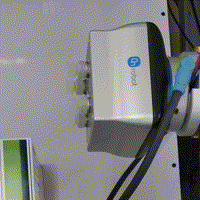

# onrobot-vg

[](https://opensource.org/licenses/MIT)


Controller for OnRobot VG10 and VGC10 grippers.

## Requirements

- Python 3.7.3
  - pymodbus==2.5.3

## Installation

```bash
git clone git@github.com:takuya-ki/onrobot-vg.git && cd onrobot-vg && pip install -r requirements.txt
```

## Usage
### Using TCP connection, e.g. Compute Box

1. Connect the cable between Compute Box and Tool Changer.
2. Connect an ethernet cable between Compute Box and your computer.
3. Execute a demo script as below  
```bash
python src/demo.py --ip 192.168.1.1 --port 502
```

  

### Using serial connection, e.g. UR Robot with RS-485 daemon forwarded to local machine

1. Make sure the RS-485 daemon is running on your robot controller and it is available on port `54321`, details: [Here](https://github.com/UniversalRobots/Universal_Robots_ToolComm_Forwarder_URCap)
2. Forward that serial connection between to your computer using `socat`:
```bash
export UR_IP=192.168.4.2
export LOCAL_DEVICE_NAME=/tmp/ttyUR
socat pty,link=${LOCAL_DEVICE_NAME},raw,ignoreeof,waitslave tcp:${ROBOT_IP}:54321
```
3. Execute a demo script as below  
```bash
python src/demo.py --device ${LOCAL_DEVICE_NAME}
```
## Author / Contributor

[Takuya Kiyokawa](https://takuya-ki.github.io/)
[Felix Warmuth](https://github.com/fwarmuth)

## License

This software is released under the MIT License, see [LICENSE](./LICENSE).
